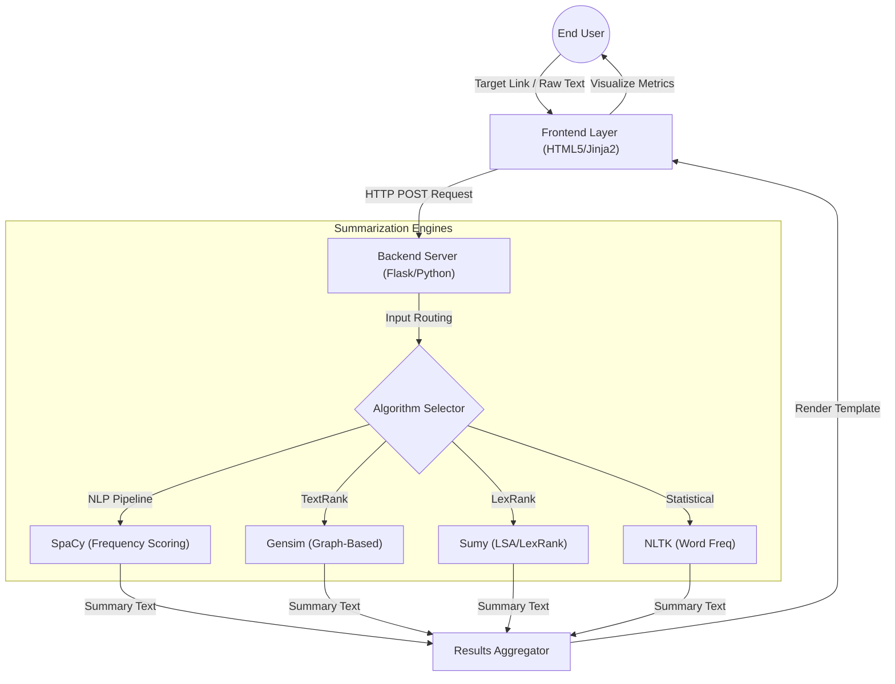

# Technical Specification: Text Summarizer

## Architectural Overview

**Text Summarizer** is a comprehensive Natural Language Processing (NLP) application designed to condense extensive textual content into concise, meaningful summaries. Unlike single-method tools, this architecture integrates multiple advanced algorithms—SpaCy, NLTK, Gensim, and Sumy—within a unified web interface, allowing researchers and developers to compare extractive summarization techniques side-by-side in real-time.

### Processing Pipeline Diagram

---

## Technical Implementations

### 1. NLP & Logic Engines: SpaCy, NLTK, Gensim, Sumy
The core functionality relies on a diverse set of industrial-strength NLP libraries to perform extractive summarization.
-   **SpaCy**: Utilizes a custom frequency-based pipeline (`spacy_summarizer.py`) to tokenize text, remove stopwords, and score sentences based on word significance.
-   **NLTK**: Implements statistical analysis (`nltk_summarization.py`) to calculate word frequencies and rank sentences without heavy dependency overhead.
-   **Gensim**: Deploys the **TextRank** algorithm, a graph-based approach similar to PageRank, for unsupervised summary generation.
-   **Sumy**: Provides access to **LexRank**, utilizing eigenvector centrality to identify the most representative sentences in a document.

### 2. Backend Orchestration: Flask
The server-side micro-framework manages application routing and data processing.
-   **Route Management**: **Flask** handles HTTP requests for distinct endpoints (`/analyze`, `/analyze_url`, `/comparer`), creating a seamless flow between input and output.
-   **Web Scraping**: Integrates **BeautifulSoup** to extract and sanitize textual content from user-provided URLs before processing.
-   **Performance Metrics**: Custom functions (`app.py`) calculate reading time savings and execution duration, providing quantitative feedback on the summarization efficiency.

### 3. Presentation Layer: Materialize CSS & jQuery
The frontend provides a responsive and intuitive research interface.
-   **UI/UX Design**: Built on **Materialize CSS**, utilizing modern components (cards, tabs, side-navs) for a clean, Material Design aesthetic.
-   **Interactive Elements**: **jQuery** powers dynamic components like result tabs and sliders, ensuring a responsive user experience across devices.
-   **Comparison View**: A dedicated layout (`compare_summary.html`) renders outputs from all algorithms simultaneously for direct qualitative evaluation.

---

## Technical Prerequisites

-   **Runtime**: Python 3.x
-   **Web Framework**: Flask 1.x+
-   **NLP Core**: SpaCy (`en_core_web_sm`), NLTK, Gensim, Sumy
-   **Utilities**: BeautifulSoup4, lxml
-   **Frontend**: Materialize CSS, jQuery

---

*Technical Specification | Computer Engineering Project | Version 1.0*
